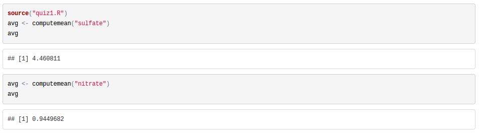
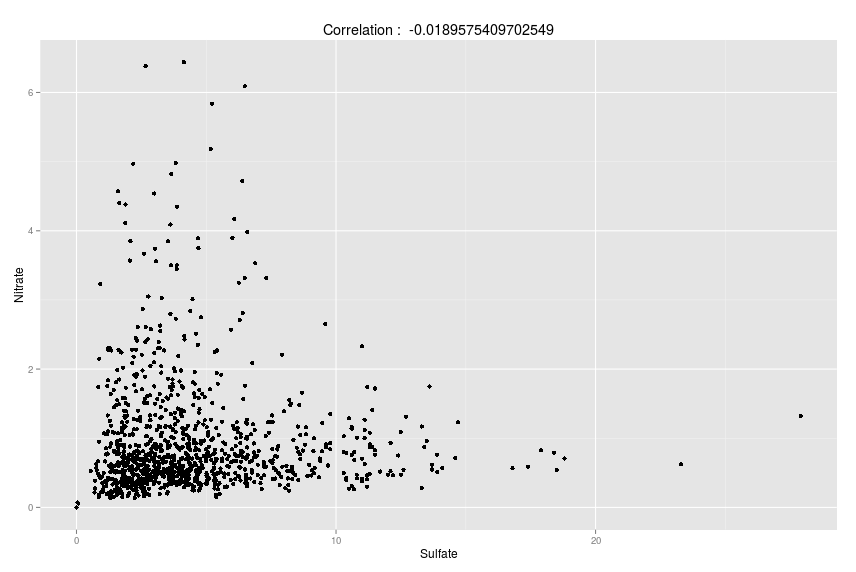

__Instructions__: This tests contains 4 questions (some of them with multiple 
sub-questions.) The total amount of points is 100. For each question, you should
always indicate which lines of code you are using to obtain the answer. The final 
document should contain all the chunks of code. You will have to submit one 
*single* zip file, containing at least the following two files:

1. this Rmd file, with all your answers and the corresponding code
2. a file called `quiz1.R`, which contains the implementation of the function 
required in Question 2.

After creating the zip file, please submit everything via campus online.

__NOTE__: Providing an answer without indicating which piece of code you used to
obtain it is not going to be considered valid.

***

# (20 points) Question 1
Read the pollutant dataset (located in the same directory of this file, see file
`pollutant.csv`) and carry out some basic exploratory analysis: (For each of the 
following question, write down the answer and create a chuck code to illustrate 
how to get that answer.)

* (5 points) How many observations to we have in the data set?
```{r}
# write the needed code here
data<-read.csv("pollution.csv")
print(nrow(data))
```

* (5 points) How many "na" do we have in the column sulfate?

```{r}
len<-length(data$sulfate[is.na(data$sulfate)])
print(len)
```


* (5 points) How many complete observations do we have, i.e., observations for 
which both the nitrate and sulfate values are given?

```{r}
print (nrow(data[which( !is.na(data$nitrate) & !is.na(data$sulfate)),]))
```

* (5 points) Print a statement writing a summary of the information 
you collected up to this point:

```{r}
summary(data)
```

***

# (30 points) Question 2 
Write a function, called `computemean()` that takes as input the pollutant type
(sulfate or nitrate) and returns the average value for that pollutant. 

You will have to write a function in a different script file (call it quiz1.R) 
and then call the function from within this markup file. The output you should
produce is provided here:
```{r}
source("quiz1.R")
avg<-computemean(data$sulfate)
avg
avg<-computemean(data$nitrate)
avg
```




***

# (20 points) Question 3
Write a code chuck that computes the correlation between the two pollutants and
creates a scatter plot for the two pollutants. The title of the plot should
contains the correlation value you computed.

The output you should produced is indicated in the picture below:

```{r}
library("ggplot2")
newdata<-na.omit(data)
x<-cor(newdata$sulfate[],newdata$nitrate)
qplot(newdata$sulfate,newdata$nitrate,main=x)+ labs(x="nitrate", y="sulfate")

```




***

# (30 points) Question 4

Consider the `mtcars` dataset. You can get information about the dataset by 
running `?mtcars`. 

* (10 points) What is the absolute difference between the average horsepower of 
4-cylinder cars and the average horsepower of 8-cylinder cars?
```{r}
print(abs(mean(mtcars$hp[mtcars$cyl==4])-mean(mtcars$hp[mtcars$cyl==8])))
```


* (10 points) Create a histogram of the distribution of mpg:
```{r}
hist(mtcars$mpg)
```


* (10 points) Compute the average miles per gallon divided by number of 
cylinders (i.e, average mpg for cars with 4 cylinders, 6 cylinders, etc.):
```{r}
mean(mtcars$mpg/mtcars$cyl)
```

